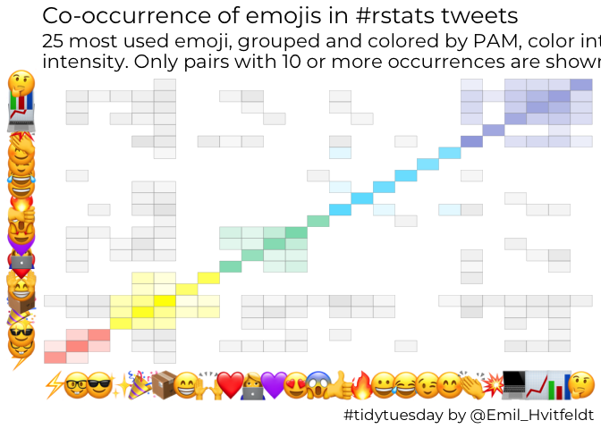

Untitled
================
Emil Hvitfeldt
1/8/2020

## 2019-12-31 Emoji Co-occurrence Chart

``` r
library(tidyverse)
```

    ## ── Attaching packages ─────────────────────────────────────── tidyverse 1.3.0 ──

    ## ✓ ggplot2 3.2.1.9000     ✓ purrr   0.3.3     
    ## ✓ tibble  2.1.3          ✓ dplyr   0.8.3     
    ## ✓ tidyr   1.0.0          ✓ stringr 1.4.0.9000
    ## ✓ readr   1.3.1          ✓ forcats 0.4.0

    ## ── Conflicts ────────────────────────────────────────── tidyverse_conflicts() ──
    ## x dplyr::filter() masks stats::filter()
    ## x dplyr::lag()    masks stats::lag()

``` r
library(paletteer)
library(ggtext)
library(rvest)
```

    ## Loading required package: xml2

    ## 
    ## Attaching package: 'rvest'

    ## The following object is masked from 'package:purrr':
    ## 
    ##     pluck

    ## The following object is masked from 'package:readr':
    ## 
    ##     guess_encoding

``` r
library(here)
```

    ## here() starts at /Users/emilhvitfeldthansen/Github/tidytuesday

``` r
set.seed(1234)
```

``` r
tweets <- read_rds(here("data/rstats_tweets.rds"))
```

``` r
all_emojis <- tweets %>%
  mutate(emoji = emo::ji_extract_all(text)) %>%
  select(emoji, status_id) %>%
  unnest(cols = c(emoji))
```

idea and code from
<https://www.hvitfeldt.me/blog/real-emojis-in-ggplot2/>

``` r
emoji_to_link <- function(x) {
  paste0("https://emojipedia.org/emoji/",x) %>%
    read_html() %>%
    html_nodes("tr td a") %>%
    .[1] %>%
    html_attr("href") %>%
    paste0("https://emojipedia.org/", .) %>%
    read_html() %>%
    html_node('div[class="vendor-image"] img') %>%
    html_attr("src")
}

link_to_img <- function(x, size = 25) {
  paste0("")
}
```

``` r
top_25 <- all_emojis %>%
  count(emoji, sort = TRUE) %>%
  slice(1:25) %>%
  select(emoji)

corr_emoji <- all_emojis %>%
  select(status_id, emoji) %>%
  inner_join(top_25, by = c("emoji" = "emoji")) %>%
  table() %>%
  crossprod()
```

``` r
links <- top_25 %>%
  mutate(url = map_chr(emoji, slowly(~emoji_to_link(.x), rate_delay(1))),
         label = link_to_img(url))
```

``` r
clusters <- corr_emoji %>%
  scale() %>%
  cluster::pam(k = 5) %>%
  .$cluster 

ooo <- clusters %>%
  order()
```

``` r
plotdata <- corr_emoji %>%
  as.data.frame() %>%
  rownames_to_column() %>%
  pivot_longer(-rowname) %>%
  filter(value >= 10) %>%
  mutate(value = log(value)) %>%
  mutate(clust = if_else(clusters[rowname] == clusters[name], clusters[rowname], 0L))

plotdata %>%
  ggplot(aes(factor(rowname, levels = names(clusters[ooo]), 
                    labels = links$label[match(names(clusters[ooo]), links$emoji)]), 
             factor(name, levels = names(clusters[ooo]), 
                    labels = links$label[match(names(clusters[ooo]), links$emoji)]), 
             fill = factor(clust),
             alpha = value)) +
  geom_tile(color = "grey60") +
  theme_minimal() +
  theme(panel.grid.major = element_blank()) +
  scale_fill_manual(values = c("grey", paletteer_d("fishualize::Sparisoma_viride"))) +
  scale_alpha(range = c(0.1, 1)) +
  guides(fill = "none",
         alpha = "none") +
  theme(axis.text.x = element_markdown(),
        axis.text.y = element_markdown(),
        title = element_text(size = 16, family = "Montserrat")) +
  labs(x = NULL, y = NULL,
       title = "Co-occurrence of emojis in #rstats tweets", subtitle = 
         str_wrap("25 most used emoji, grouped and colored by PAM, color intensity corresponds to intensity. Only pairs with 10 or more occurrences are shown.", 80),
       caption = "#tidytuesday by @Emil_Hvitfeldt")
```

<!-- -->

``` r
ggsave(here("2019-12-31", "co-occurrence.png"), 
       width = 10, height = 10, dpi = 300, type = "cairo")
```
