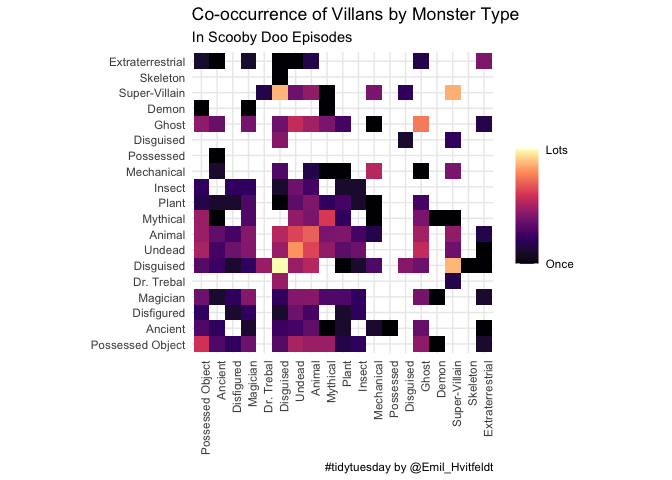

Untitled
================
Emil Hvitfeldt
7/15/2021

## R Markdown

``` r
library(tidyverse)
```

    ## ── Attaching packages ─────────────────────────────────────── tidyverse 1.3.1 ──

    ## ✓ ggplot2 3.3.5     ✓ purrr   0.3.4
    ## ✓ tibble  3.1.3     ✓ dplyr   1.0.7
    ## ✓ tidyr   1.1.3     ✓ stringr 1.4.0
    ## ✓ readr   1.4.0     ✓ forcats 0.5.1

    ## ── Conflicts ────────────────────────────────────────── tidyverse_conflicts() ──
    ## x dplyr::filter() masks stats::filter()
    ## x dplyr::lag()    masks stats::lag()

``` r
scoobydoo <- readr::read_csv('https://raw.githubusercontent.com/rfordatascience/tidytuesday/master/data/2021/2021-07-13/scoobydoo.csv')
```

    ## 
    ## ── Column specification ────────────────────────────────────────────────────────
    ## cols(
    ##   .default = col_character(),
    ##   index = col_double(),
    ##   date_aired = col_date(format = ""),
    ##   run_time = col_double(),
    ##   monster_amount = col_double(),
    ##   unmask_other = col_logical(),
    ##   caught_other = col_logical(),
    ##   caught_not = col_logical(),
    ##   suspects_amount = col_double(),
    ##   culprit_amount = col_double(),
    ##   door_gag = col_logical(),
    ##   batman = col_logical(),
    ##   scooby_dum = col_logical(),
    ##   scrappy_doo = col_logical(),
    ##   hex_girls = col_logical(),
    ##   blue_falcon = col_logical()
    ## )
    ## ℹ Use `spec()` for the full column specifications.

``` r
co_occur <- function(x) {
  if (length(x) == 1) {
    return(data.frame(V1 = character(), V2 = character()))
  }
  as.data.frame(
    rbind(
      t(combn(x, m = 2)),
      t(combn(x, m = 2))[, c(2, 1)]
    )
  )
}

scoobytoo <- scoobydoo %>%
  select(index, monster_type) %>%
  separate_rows(monster_type, sep = ",") %>%
  filter(monster_type != "") %>%
  mutate(monster_type = if_else(monster_type %in% c("Disugised", "Disguise"),
                                "Disguised", monster_type)) %>%
  group_by(index) %>%
  summarise(co_occur(monster_type), .groups = "drop") %>%
  count(V1, V2)

scoobywide <- scoobytoo %>%
  pivot_wider(names_from = "V2", values_from = "n", values_fill = 0) %>%
  rename(term = V1)

class(scoobywide) <- c("cor_df", class(scoobywide))

corrr::rearrange(scoobywide) %>%
  corrr::stretch() %>%
  filter(r > 0) %>%
  mutate(across(c(x, y), factor, levels = unique(x))) %>%
  ggplot(aes(x, y, fill = r)) +
  geom_tile() +
  scale_fill_viridis_c(
    option = "A", trans = "log",
    breaks = c(1, max(scoobytoo$n)), labels = c("Once", "Lots")) +
  theme_minimal() +
  theme(axis.text.x = element_text(angle = 90, hjust = 1)) +
  coord_fixed() +
  labs(x = NULL, y = NULL, fill = NULL,
       title = "Co-occurrence of Villans by Monster Type",
       subtitle = "In Scooby Doo Episodes",
       caption = "#tidytuesday by @Emil_Hvitfeldt")
```

<!-- -->

``` r
ggsave(here::here("2021-07-13", "co-occurrence.jpg"), 
       width = 10, height = 10, dpi = 300)
```
