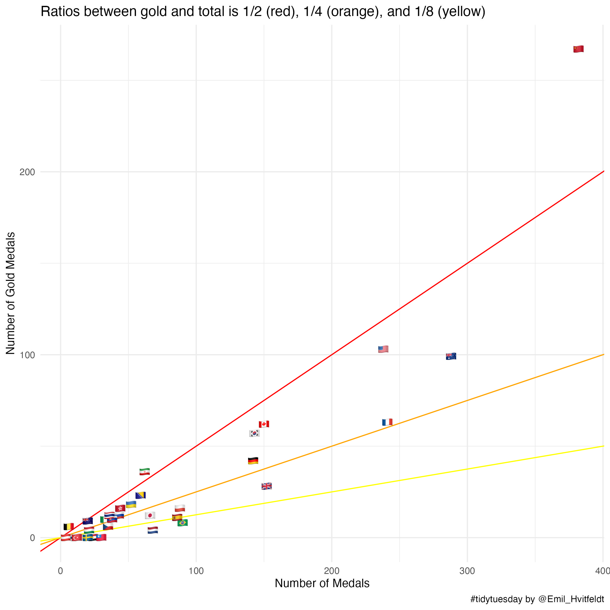

Untitled
================
Emil Hvitfeldt
3/8/2021

## R Markdown

``` r
library(tidyverse)
library(emoji)
athletes <- readr::read_csv('https://raw.githubusercontent.com/rfordatascience/tidytuesday/master/data/2021/2021-08-03/athletes.csv')

countries <- athletes %>%
  count(country) %>%
  filter(n > 9) %>%
  filter(!is.na(country), country != "-")

athletes %>%
  filter(year >= 2000) %>%
  inner_join(countries, by = "country") %>%
  mutate(country = case_when(
    country == "Bosnia and Herzegovina" ~ "Bosnia & Herzegovina",
    country == "Chinese Taipei" ~ "Taiwan",
    country == "Czech Republic" ~ "Czechia",
    country == "Great Britain" ~ "United Kingdom",
    country == "Hong Kong" ~ "Hong Kong SAR China",
    country == "Korea" ~ "South Korea",
    country == "United States of America" ~ "United States",
    TRUE ~ country
  )) %>%
  mutate(country = flag(country)) %>%
  group_by(country) %>%
  summarise(n_medal = n(),
            n_gold = sum(medal == "Gold")) %>%
  ggplot(aes(n_medal, n_gold, label = country)) +
  geom_abline(intercept = 0, slope = c(0.5, 0.25, 0.125), 
              color = c("red", "orange", "yellow")) +
  geom_text() +
  theme_minimal() +
  labs(x = "Number of Medals", y = "Number of Gold Medals",
       title = "Ratios between gold and total is 1/2 (red), 1/4 (orange), and 1/8 (yellow)",
       caption = "#tidytuesday by @Emil_Hvitfeldt")

ggsave(here::here("2021-08-03", "medels.jpg"), bg = "white",
       width = 8, height = 8, dpi = 300)
```


