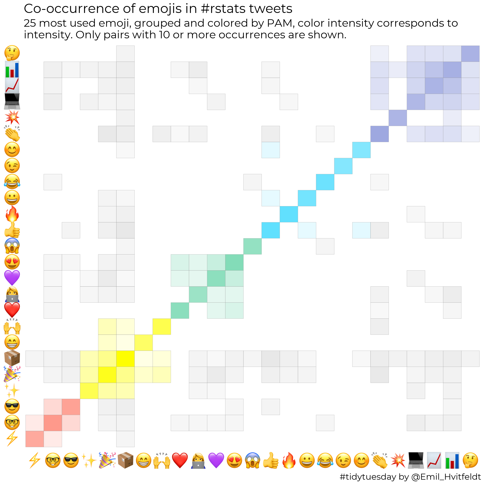

<h1 style="font-weight:normal" align="center">
  &nbsp;TidyTuesday Gallery&nbsp;
</h1>

[Twitter][Twitter] :speech_balloon:&nbsp;&nbsp;&nbsp;|&nbsp;&nbsp;&nbsp;[LinkedIn][LinkedIn] :necktie:&nbsp;&nbsp;&nbsp;|&nbsp;&nbsp;&nbsp;[GitHub :octocat:][GitHub]&nbsp;&nbsp;&nbsp;|&nbsp;&nbsp;&nbsp;[Website][Website] :link:

<!--
Quick Link 
-->

[Twitter]:https://twitter.com/Emil_Hvitfeldt
[LinkedIn]:https://www.linkedin.com/in/emilhvitfeldt/
[GitHub]:https://github.com/EmilHvitfeldt
[Website]:https://www.hvitfeldt.me/

  
<strong>Table of Contents</strong> (click to expand)

<!-- toc -->
- [Emoji co-occurrence](https://github.com/zhiiiyang/tidytuesday#Emoji co-occurrence)
<!-- tocstop -->

## Emoji co-occurrence

  

**Data**: `#rstats` and `#TidyTuesday` Tweets from `rtweet` [here](https://github.com/rfordatascience/tidytuesday/tree/master/data/2019/2019-01-01)

**Code**: click [here](2019-12-31/README.md)

**Note**: This vizualization was inspired by [post](https://www.hvitfeldt.me/blog/real-emojis-in-ggplot2/)
